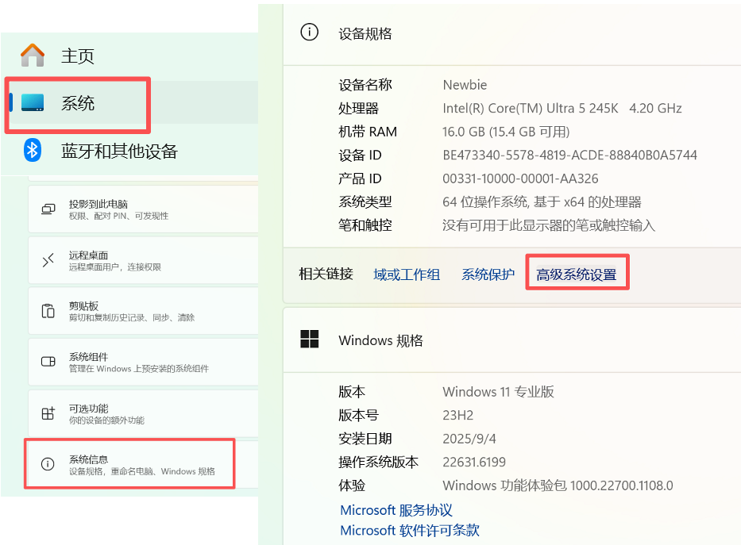
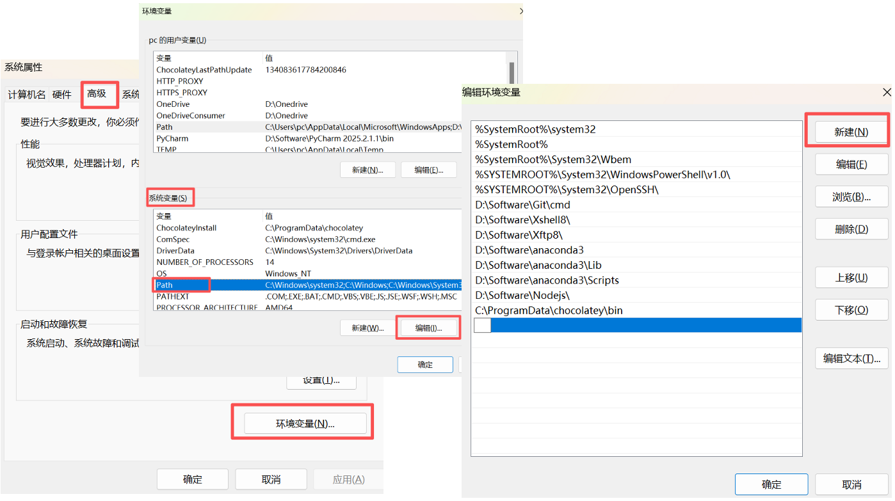

# 环境变量的配置教程

本文记录 `环境变量` 的安装、配置和网络说明。

## 1. windows系统

按win+i，进入设置。点击**系统-系统信息-高级系统设置**


高级-环境变量
进入系统变量，点击选中PATH，点击编辑
选择新建，根据exe的实际位置添加路径

  



请务必留意想要增加的路径一定是自己程序**真实所在路径的父目录**，举例仅供参考。

### 1.1 比如我自己的**anaconda真实路径**为：

```text
D:\Software\anaconda3\Scripts\conda.exe
```

增加的环境变量为（推荐新增这三个）：

```text
D:\Software\anaconda3
D:\Software\anaconda3\condabin
D:\Software\anaconda3\Scripts
```

### 1.2 再比如我自己的**git真实路径**为：
```text
D:\Software\Git\cmd\git.exe
```

增加的环境变量为：

```text
D:\Software\Git\cmd
```

### 1.3 再再比如我自己的**Nodejs真实路径**为：
```text
D:\Software\Nodejs\node.exe
```

增加的环境变量为：

```text
D:\Software\Nodejs
```

Note：环境变量的路径末尾不需要加反斜杠 `\` ， 无视图片里有些加了 `\` 的例子

增加完点击确定-确定-确定即可。

---
## 2. linux系统

主要在终端打开shell配置文件进行配置，先打开配置文件

```bash
nano ~/.bashrc
```

在打开的配置文件里按↓一直到最后一行，

- 切记**千万不要按ctrl+c或者ctrl+v**，shell里的复制粘贴指令不一样！！！
- 在shell的配置文件里选中一段文字点击左键会直接复制，在不选中文字的情况下点击右键会直接粘贴
- 因此推荐先在外面环境ctrl+c复制，进shell配置文件后，在最后一行点击右键直接粘贴，或者你也可以手动输入。
- 和windows系统类似，请务必留意想要增加的路径一定是自己程序**真实所在路径的父目录**，举例仅供参考。

真实路径例子：
```bash
/home/zjc/software/anaconda3/bin/conda
/home/zjc/software/anaconda3/envs/memsifter/bin/git
/home/zjc/software/node/node-v22/bin/node
```

需要加到shell配置文件最后一行的内容：
```bash
export PATH="/home/zjc/software/anaconda3/bin:$PATH"
export PATH="/home/zjc/software/anaconda3/envs/memsifter/bin:$PATH"
export PATH="/home/zjc/software/node/node-v22/bin:$PATH"
```

在输入完毕后，按**ctrl+o**，再回车触发保存，再按**ctrl+x**退出shell配置文件。

在终端里输入，让配置生效

```bash
source ~/.bashrc
```

可在终端里验证环境变量是否有效：

```bash
which conda
which git
which node
```

若输出有效信息，说明环境变量配置成功。