# 一、大方向：计算机视觉CV，自然语言处理NLP

# 二、将一句话进行分词操作，有BPE和BBPE的方法

| BPE                                                                                                                                                                                                                                                                                                                                                                  | BBPE                                                                                                                                                                                                                          |
| -------------------------------------------------------------------------------------------------------------------------------------------------------------------------------------------------------------------------------------------------------------------------------------------------------------------------------------------------------------------- | ----------------------------------------------------------------------------------------------------------------------------------------------------------------------------------------------------------------------------- |
| 假设对以下字符串 abababc 进行BPE编码。  初始词表：a,b,c  统计相邻字符的词频：ab：3，ba：2，bc：1  合并频率最高的字符对 ab  用一个未在初始词表中的字符，将 ab 合并为一个新的符号 X，同时记录替换关系 X = ab  更新字符串：XXXc  更新词表：a,b,c,X  统计相邻字符的词频：XX：2，Xc：1  合并频率最高的字符对 XX  用一个未在初始词表中的字符，将 XX 合并为一个新的符号 Y，同时记录替换关系 Y = XX  更新字符串：YXc  更新词表：a,b,c,X,Y  统计相邻字符的词频：YX：1，Xc：1 | BPE字符级：你好  BBPE字节级：\xe4 \xbd \xa0 \xe5 \xa5 \xbd  BBPE构建词表步骤：  1. 先将单词拆成单个字符，再将字符转化为单个字节，构建初始字节词表  2. 接着找出频率最高字节对合并成新字节加入词表，同时在语料库中替换原字节对，新字节还能参与后续合并  3. 最后不断重复上述步骤，直到词表字节数达预设阈值 V 或剩下字节对频率为 1 |

跨语言通用性：BBPE在字节级别进行操作，可以更容易地处理多种语言的文本，而不需要为每种语言单独构建词表，同时还显著压缩词表的大小，提高了计算效率

更好的解决OOV问题：BBPE将字符统一映射至字节空间，使相同词表容量下覆盖更广的字符及组合，可以更高效兼容OOV问题，同时兼顾词表紧凑性与表达能力。

# 三、为什么神经网络可以拟合任意函数？

## 一条直线的例子
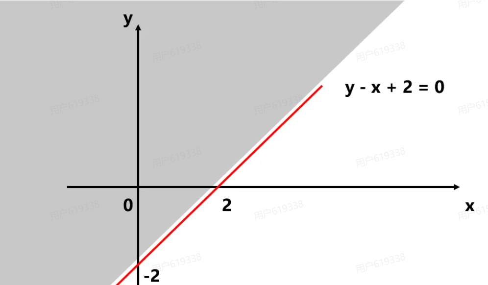

将点(2,2)代入方程y-x +2 = 2
将点(2,-2)代入方程y-x +2 = -2
不难发现，将直线上方的点代入方程后，最终结果会大于0；将直线下方的点代入方程后，最终结果会小于0。
我们用z来表示方程的结果z = y - x +2，可以得出以下结论：
- 随机带入一个点，当z大于0时，说明点在直线的上方
- 随机带入一个点，当z小于0时，说明点在直线的下方
那么我们只要再构造一个判断函数来判断z的值是大于0还是小于0，即可判断该点在图中的位置。
- 如果它在直线上方（z大于0），我们就令它为真，让判断函数输出1
- 如果它在直线下方（z小于0），我们就令它为假，让判断函数输出0
- 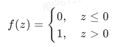

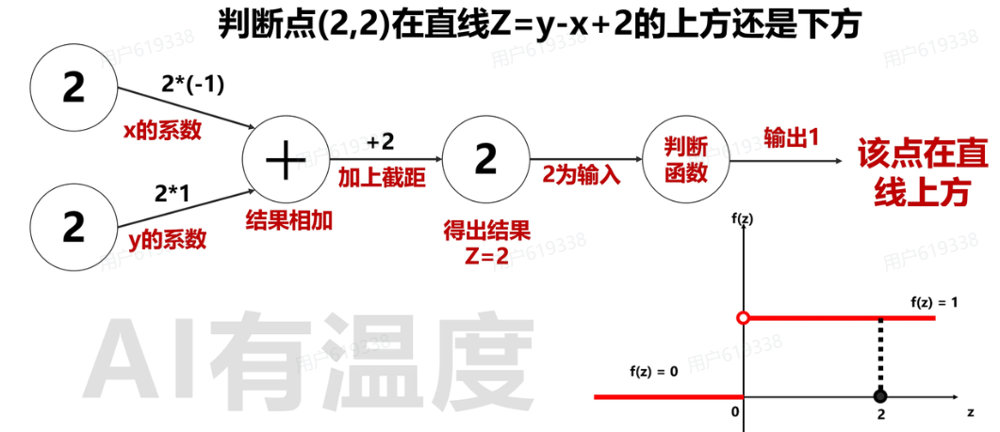

## 三角形区域的例子

根据上文一条直线的例子，我们不难理解，当三个判断函数的输出均为1时，这个点就在三角形内部。

因此，我们需要对三个判断函数输出值是否均为1进行二次判断。我们可以把三个判断函数的输出看作新的输入，再经过一次线性变化和判断函数，最后让它输出0或1，来判断一点是否在三角形内部。

| 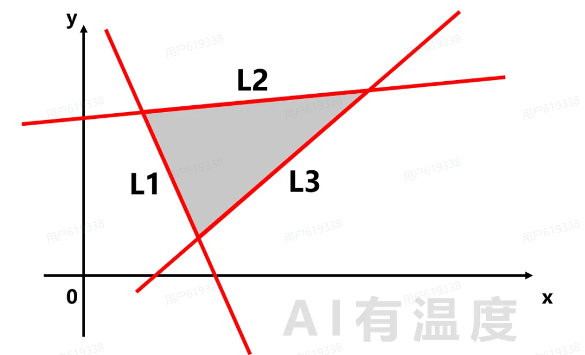 | 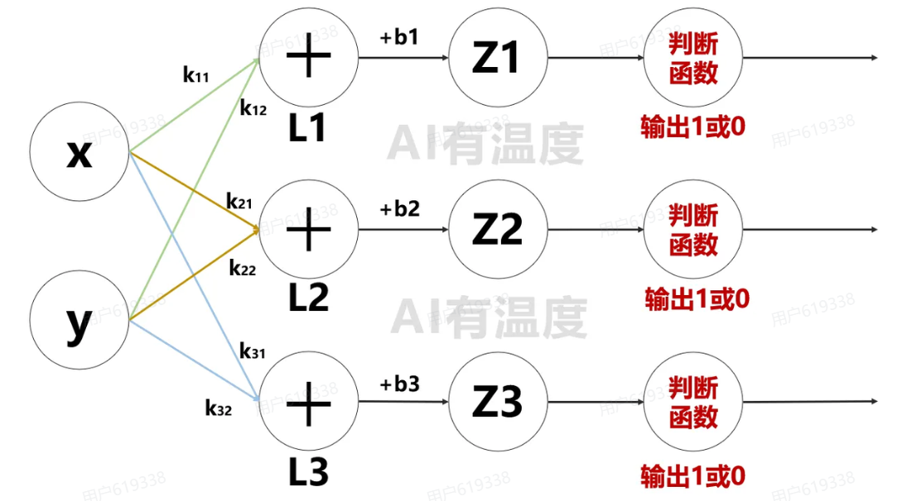 |
| ------------------------------------ | ------------------------------------ |

## 圆的例子

| 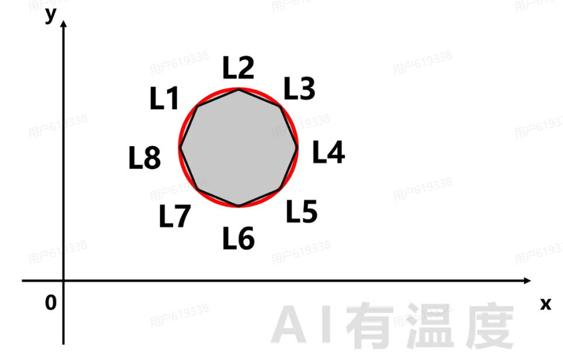 |  |
| ------------------------------------ | ------------------------------------ |

## 不规则图形的例子

| 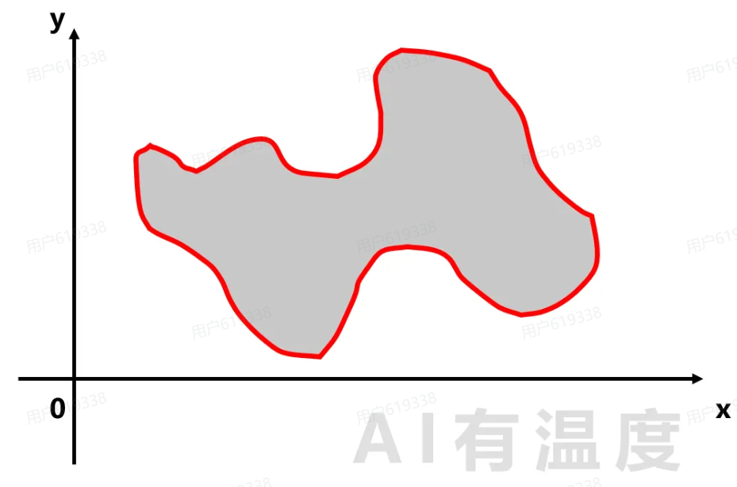 | 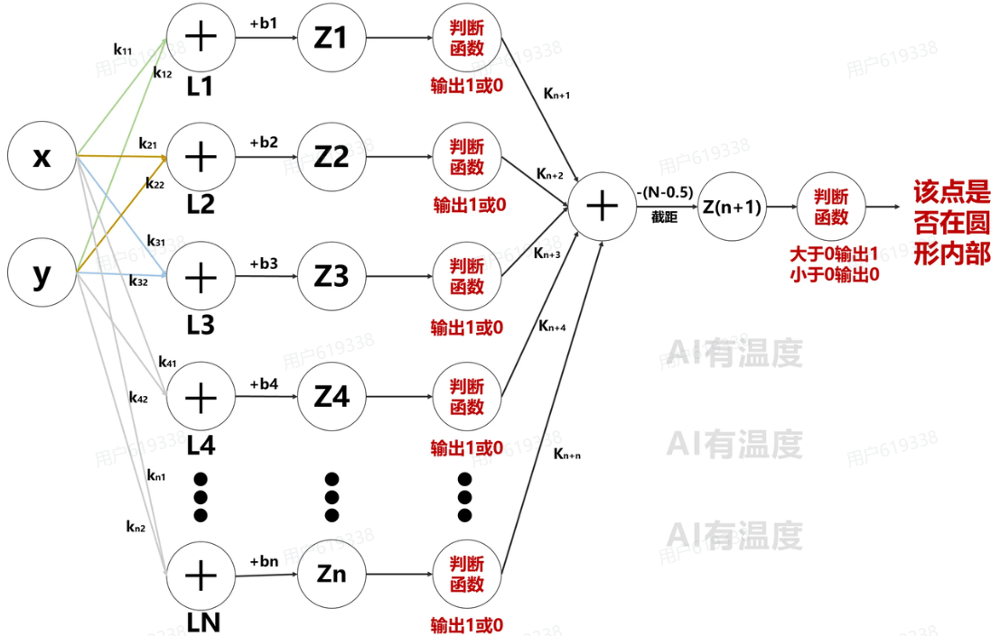 |
| ------------------------------------ | ------------------------------------ |

## 多个图形的例子

| 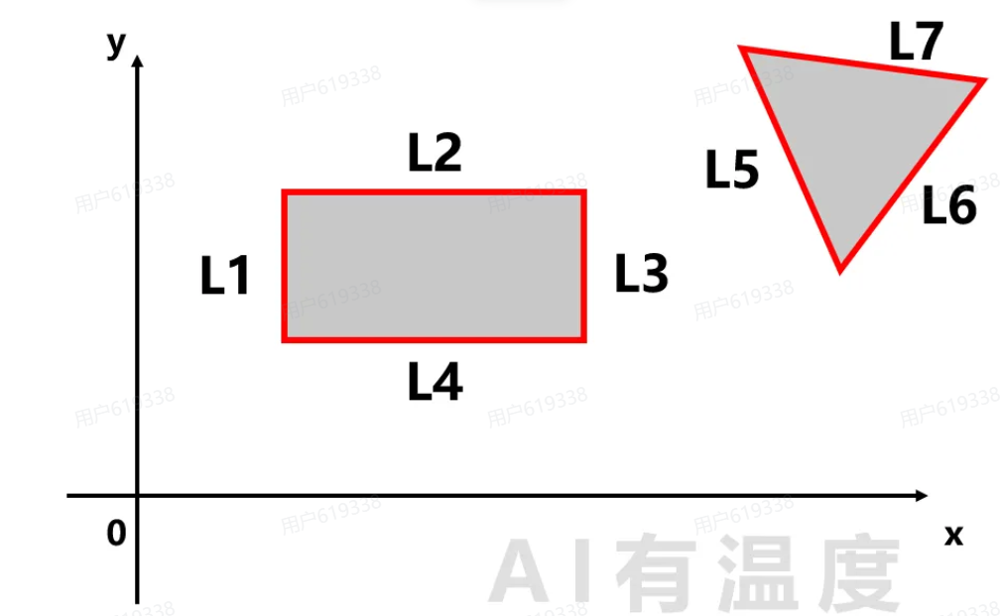 | 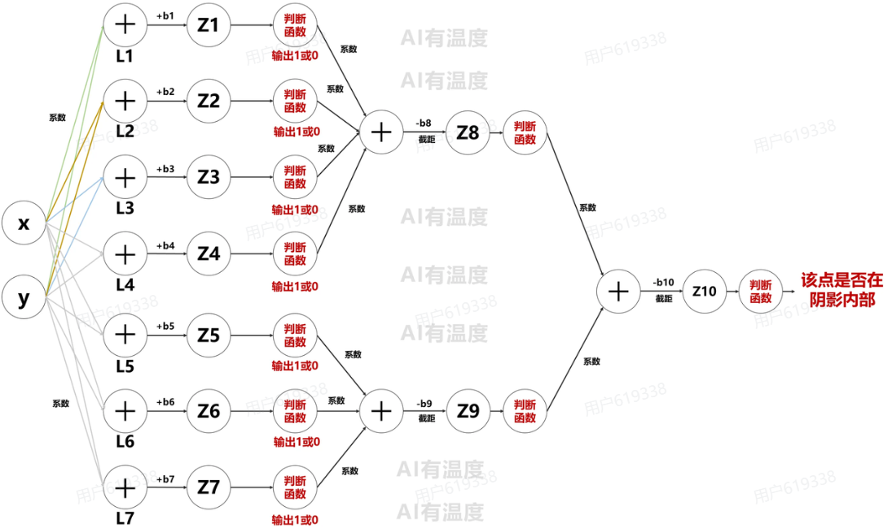 |
| ------------------------------------ | ------------------------------------ |
如果有N个图形，则第二层有N个神经元，代表N次相加。

在二维平面内的所有问题（任何形状、任意多少区域）都可以使用3层神经网络来解决。第1层各圈各的，第2层加在一起，第3层输出最终判断。神经网络的精妙之处在于，将前一层的多个输出值再次构造成一个新的线性函数从而进行再判断，以此类推。神经网络不断从线性变为非线性的过程，就是提取数据特征的过程。

## 多分类的例子

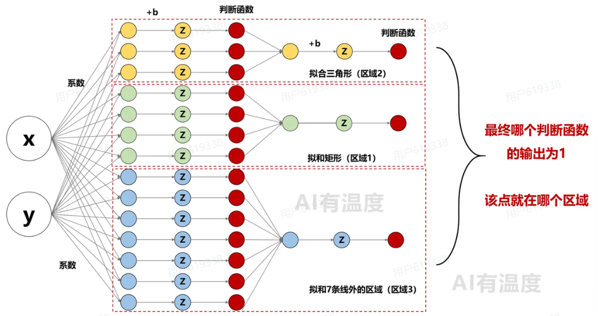几分类问题就设置几个输出，最后哪个判断函数的输出为1，该点就在哪个区域

人工智能的本质：只要直线个数够多、维度够多，就可以拟合任意空间，解决任何问题。难点就在于这些直线的参数(k,b)的值事先是不知道的、是随机初始化的。科学家们不断探索研究的核心之一就是通过数据设计算法找到合适的参数值。再遇到类似问题时，就可以用已经学习到的参数来解决问题。

# 四、Layer Normalization与Batch Normalization有什么不同？

Batch Normalization对 Batch 内同一位置的特征计算均值与方差，进行标准化操作，就会存在两个问题：
	问题一：Batch内句子实际长度不一致，BN 在 Batch 内同一位置进行标准化会被 PAD 干扰，一个token的词向量分布会发生变化，破坏了 token 的原有含义。
	问题二：在不同语境中，同一 token 的 Norm 处理受随机 batch内不同数据的影响，破坏语言建模中token向量的上下文一致性。

Layer Normalization对每个token的向量进行标准化操作，不同的token互不影响。可以独立处理单个样本，不受序列长度变化影响。

| Batch Norm                          | Layer Norm                          |
| ----------------------------------- | ----------------------------------- |
| 对同一batch内的词向量，按特征维度竖着做归一化           | 对一个词，按token维度横着做归一化                 |
| 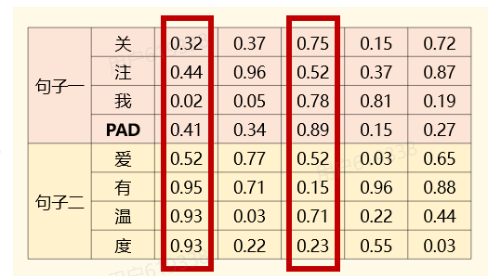 | 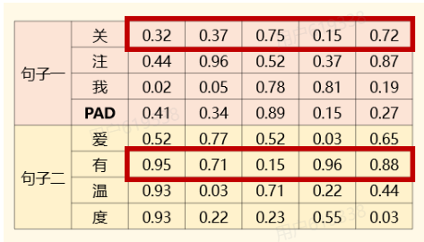 |
所以Trm里都是layer norm而不是batch norm
